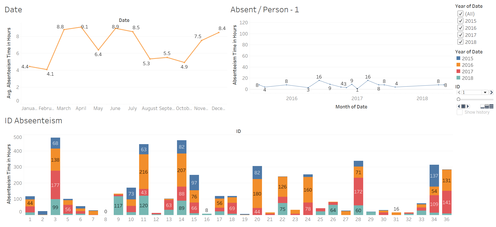
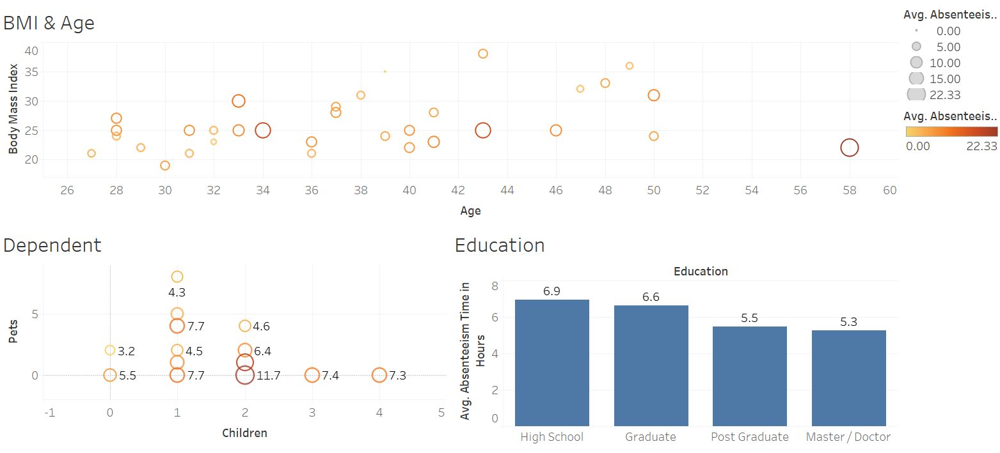
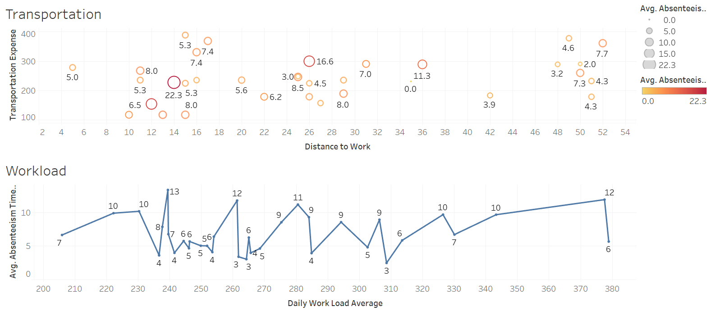

# Performance-Improvement-Absenteeism-at-Work

In this project, i want to share how absenteeism can impact for performance on organization and the problem of it. To solve that problem i use data analytics to describe the pattern using Tableau and predict which employee will absent so organization can take action and prevent the problem.

 
For full report of project, please visit <a href="https://github.com/Juantonios1/Performance-Improvement-Absenteeism-at-Work/blob/main/Absenteeism%20at%20Work.ipynb">Absenteeism at Work</a>.

## Summary Process
<!-- TABLE OF CONTENTS -->

  
Table of Content

  <ol>
    <li>
      <a href="#business-background">Business Background</a>
    </li>
    <li>
      <a href="#data-understanding">Data Understanding</a>
    </li>
    <li>
      <a href="#exploratory-data-analysis">Exploratory Data Analysis</a>
    </li>
    <li><a href="#data-preprocessing">Data Preprocessing</a></li>
    <li><a href="#data-analytics">Data Analytics</a></li>
    <li><a href="#model-selection">Model Selection</a></li>
    <li><a href="#explainable-and-interpretable-machine-learning">Explainable and Interpretable Machine Learning</a></li>
    <li><a href="#preprocessing-new-dataset">Preprocessing New Dataset</a></li>
    <li><a href="#prediction-result">Prediction Result</a></li>
    <li><a href="#conclusion">Conclusion and Recommendation</a></li>
    <li><a href="#contributors">Contributors</a></li>
  </ol>

## Business Background
**Context :**  
Employee motivation, shift work system, team work and other means of enhancing employee happiness and job satisfaction have been applied by management to reduce employee absenteeism and labour turnover to improve overall organizational performance. However, despite the awareness of the adverse effect of absenteeism on overall organizational productivity and performance, the level of absenteeism tend to remain high. Absenteeism defined as any failure of an employee to report for or remain at work as scheduled, regardless of reason, expresses a monitory implication. The term ‘as scheduled’ is very significant, for this automatically excludes vacations, holidays, jury duty and the like. It also eliminates the problem of determining whether the absenteeism is excusable or not. Medically verified illness is a good example</a>.  

**Problem Statement :**  
From a business perspective, the employee is absent and is simply not available to perform his or her job, which means the absenteeism will cost money. Absenteeism is costly because it reduces output and is disruptive because it requires that schedules and programmes be modified and one of the contributory factors in the failure of organisations a departments to meet performance targets.

**Goals :**  
We want to predict how many working hours an employee could be away from work so we can reordering the task to improve performance and work quality and we want to know which Employee will absent.

## Data Understanding

| Feature      	| Description                                                                                                                                                                                                               	|
|--------------	|---------------------------------------------------------------------------------------------------------------------------------------------------------------------------------------------------------------------------	|
| ID        	| Unique ID for customer                                                                                                                                                                                                           	|
| Reason of absence      	| Reasons 1-21 are registered in the International Classification Diseases(ICD)                                                                                                                                                                                	|
| Date   	| Date of Absence                                                                                                                                                                               	|
| Transportation Expense         	| Cost related to business travel (fuel, parking, meals, etc)                                                                                                                                                                                                         	|
| Distance to work       	| Distance measured in km                    	|
| Age     	| Years of age                                                                                                                                                                                     	|
| Daily workload average  	| Measured in minutes	|
| Body Mass Index       	| Number based on your weight and height                                                                                                                                                                                                        	|
| Education         	| Representing different levels of education                                                                                                                                                      	|
|Childern    	| Number children in the family	|
|Pets       	| Number of pets in family                                                                                                                                                                                                            	|
|Absenteeism time in hours         	| Time that employee dont do their task                                                                                                                                                  	|

## Exploratory Data Analysis
At this stage, a brief analysis of the data will be carried out, as follows:
* Distribution Data
* Normal Test
* Data Correlation
* Data Cardinalities
* Identify Missing Values

## Data Preprocessing
At this stage, data preparation and processing will be carried out before being used as a data model, as follows:
* Casting Data Type
* Encode
* Categorization
* Extract Date Feature
* Splitting

## Data Analytics
At this stage, another information analysis will be carried out, as follows:
* Information Abseenteism in Company

* Personal Information of Employee

* Daily Work

  You can also see full dashboard at <a href="https://public.tableau.com/app/profile/juan1691/viz/AnalysisAbseenteismProject/AnalysisAbseenteism">Tableau</a>.  

## Model Selection
At this stage will be done making and optimizing the machine learning model, as follows:
* Model Benchmark
* Hyperparameter Tuning

## Explainable and Interpretable Machine Learning
At this stage there will be an explanation in the decision making of the machine learning model, in the following ways:
* Feature Importance
* SHAP 

## Preprocessing New Dataset
At this stage, preprocessing stage will apply to new data set which want to predict

## Prediction Result
At this stage, new data set will predict with selected model before, in the following ways:
* Predict New Dataset
* Import to CSV File
* <a href="https://public.tableau.com/app/profile/juan1691/viz/PredictedAbsenteeismProject/PredictedInformation">Prediction Analysis</a>.  

## Conclusion 
We conclude our result and give recommendation based on it
* Summary Model
* Business Insight
* Conclusion

## Contributors:
Juan Antonio Suwardi - antonio.juan.suwardi@gmail.com  
