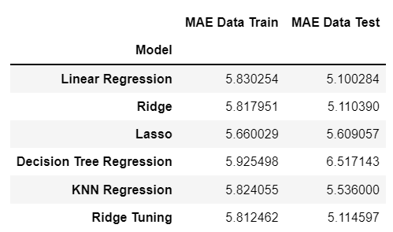

# Absenteeism Analysis

In this project, i want to share how absenteeism can impact for performance on organization and the problem of it. To solve that problem i use data analytics to describe the pattern using Tableau and predict which employee will absent so organization can take action and prevent the problem using regression method (supervised learning).

 
For full report of this project, please visit <a href="https://github.com/Juantonios1/Performance-Improvement-Absenteeism-at-Work/blob/main/Absenteeism%20at%20Work.ipynb">Absenteeism at Work</a>.

## Summary Process
<!-- TABLE OF CONTENTS -->

  
Table of Content

  <ol>
    <li>
      <a href="#business-background">Business Background</a>
    </li>
    <li>
      <a href="#data-understanding">Data Understanding</a>
    </li>
    <li>
      <a href="#exploratory-data-analysis">Exploratory Data Analysis</a>
    </li>
    <li><a href="#data-preprocessing">Data Preprocessing</a></li>
    <li><a href="#data-analytics">Data Analytics</a></li>
    <li><a href="#model-selection">Model Selection</a></li>
    <li><a href="#explainable-and-interpretable-machine-learning">Explainable and Interpretable Machine Learning</a></li>
    <li><a href="#preprocessing-new-dataset">Preprocessing New Dataset</a></li>
    <li><a href="#prediction-result">Prediction Result</a></li>
    <li><a href="#conclusion">Conclusion and Recommendation</a></li>
    <li><a href="#contributors">Contributors</a></li>
  </ol>

## Business Background
**Context :**  
Organizations for years have been looking for ways to improve human resource management by paying attention to aspects such as work organization, organizational environment, or personal issues to reduce employee absenteeism at work and to reduce high employee turnover. However, with the various ways that have been done so far, the absenteeism rate in some organizations still tends to be high. Absenteeism defined as any failure of an employee to report for or remain at work as scheduled, regardless of reason, expresses a monitory implication. The term ‘as scheduled’ is very significant, for this automatically excludes vacations, holidays, jury duty and the like. It also eliminates the problem of determining whether the absenteeism is excusable or not. The absence of workers from the workplace can be disruptive and increase costs for the organization and is an indication that there is poor work adjustment for employees.</a>.  

**Problem Statement :**  
From a business perspective, employees who are not present to do their jobs, will cost more than they should. The absence is a big problem because it reduces output and is annoying because it requires rescheduling and changing programs which is one of the contributing factors to the failure of a department's organization to meet performance targets.

**Goals :**  
Based on these problems, this analysis is carried out to predict how long an employee will be absent from work and what factors affect the length of time someone is absent from work so that the organization can rearrange tasks to improve work performance and quality and find out which employees will be absent. To get answers to these problems, an analysis is carried out using supervised machine learning: regression.

## Data Understanding

| Feature      	| Description                                                                                                                                                                                                               	|
|--------------	|---------------------------------------------------------------------------------------------------------------------------------------------------------------------------------------------------------------------------	|
| ID        	| Unique ID for customer                                                                                                                                                                                                           	|
| Reason of absence      	| Reasons 1-21 are registered in the International Classification Diseases(ICD)                                                                                                                                                                                	|
| Date   	| Date of Absence                                                                                                                                                                               	|
| Transportation Expense         	| Cost related to business travel (fuel, parking, meals, etc)                                                                                                                                                                                                         	|
| Distance to work       	| Distance measured in km                    	|
| Age     	| Years of age                                                                                                                                                                                     	|
| Daily workload average  	| Measured in minutes	|
| Body Mass Index       	| Number based on your weight and height                                                                                                                                                                                                        	|
| Education         	| Representing different levels of education                                                                                                                                                      	|
|Childern    	| Number children in the family	|
|Pets       	| Number of pets in family                                                                                                                                                                                                            	|
|Absenteeism time in hours         	| Time that employee dont do their task                                                                                                                                                  	|

## Exploratory Data Analysis
At this stage, a brief analysis of the data will be carried out, as follows:
* Distribution Data
* Normal Test
* Data Correlation
* Data Cardinalities
* Identify Missing Values

## Data Preprocessing
At this stage, data preparation and processing will be carried out before being used as a data model, as follows:
* Casting Data Type
* Encode
* Categorization
* Extract Date Feature
* Splitting

## Data Analytics
At this stage, another information analysis will be carried out, as follows:
* Information Abseenteism in Company  
  
* Personal Information of Employee  
  
* Daily Work  
  
You can also see full dashboard of analysis at <a href="https://public.tableau.com/app/profile/juan1691/viz/AnalysisAbseenteismProject/AnalysisAbseenteism">Analysis Tableau</a>.  

## Model Selection
At this stage will be done making and optimizing the machine learning model, as follows:
* Model Benchmark (Linear Regression, Ridge, KNN Regression, Lasso, and Decision Tree Regression)
* Hyperparameter Tuning
For summary can see on picture below:

## Explainable and Interpretable Machine Learning
At this stage there will be an explanation in the decision making of the machine learning model, in the following ways:
* Feature Importance
* SHAP  

## Preprocessing New Dataset
At this stage, preprocessing stage will apply to new data set which want to predict

## Prediction Result
At this stage, new data set will predict with selected model before, in the following ways:
* Predict New Dataset
  * For view the result of prediction, please visit <a href="https://github.com/Juantonios1/Performance-Improvement-Absenteeism-at-Work/blob/main/Data_set/Absenteeism_data_predict.csv">Prediction Dataset</a>.  

* Import to CSV File
* Prediction Analysis
  * For view the full analysis of prediction dataset, please visit <a href="https://public.tableau.com/app/profile/juan1691/viz/PredictedAbsenteeismProject/PredictedInformation">Prediction Tableau</a>.  

## Conclusion 
We conclude our result and give recommendation based on it
* Summary Model  
  
* Business Insight
  * January & February have the less average abseenteism beside that March, April, and June have most average abseenteism time. Maybe in this month spirit of employee is down and they use the reason to absent
  * BMI and Age dont have specific pattern with Abseenteism
  * Employee with 2 Children and 1 or 2 pets have more abseenteism time then the others
  * Reason 1 (deseases) & 4 (poison illness) are the most reason when employee absent. It mean company less care about the healthy of employee
  * 6 - 11 and day 20 - 24 have more abseenteism time then other day. May be there are some traffic at that day every month
  * Low distance (under 28) have higher absenteeism time than higher distance
  * Low daily workload have higher absenteeism time than higher daily workload. It may be they think thay have more free time so they can do absent
  * Company must check employee with ID 3,11, 14 because they have track record to have high absenteeism time
  * ID 34, 9, 36 predicted will have high absenteeism
* Recommendation
  * The company need to mantain employee spirit. They can make some event to keep employee spirit like gathering or eat together for every division
  * For every director or supervisor can reduce the workload for every senior employee so they can mantain their health and prevent absenteeism time
  * Every supervisor need to remind their employee to do their task even they need to look after their children or pet
  * Employee need to upgrade their health facilities in office or have some link with health facilities near at office so employee no need to waste much time to go to other hospital
  * If can, company can give lunch menu or give some snack at office to prevent employee have poison illness
  * Every supervisor or director need to track their employee task or make schedule so the employee will stay on track. It include ID 34, 9, 36 who predicted will have high absenteeism
  * HR team need to call id 3,11, 14 to ask what improvement that they need to reduce absenteeism time

## Contributors:
Juan Antonio Suwardi - antonio.juan.suwardi@gmail.com  
